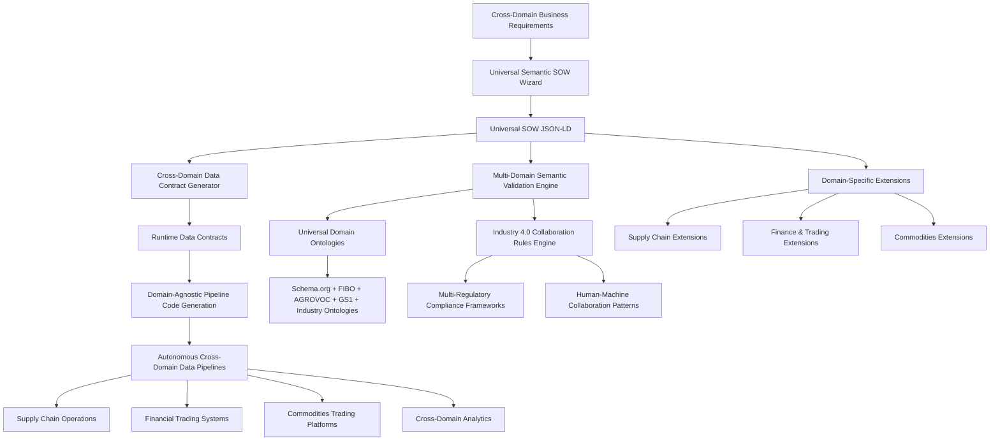

# ADR-004: Universal Industry 4.0 Semantic SOW Architecture for Cross-Domain Collaboration

**Status:** Proposed  
**Date:** 2025-09-05  
**Authors:** François Rosselet, Claude (Anthropic)  
**Reviewers:** TBD  
**Implementation Branch:** `adr-4-semantic-sow-data-contracts`

## Context

Traditional data pipeline development suffers from a fundamental disconnect between business requirements and technical implementation across supply chain, financial, and commodities domains. Current Statement of Work (SOW) documents are unstructured text that require extensive manual interpretation, leading to:

1. **Semantic Gap**: Business requirements lose context during translation to technical specifications across diverse industrial sectors
2. **Manual Pipeline Generation**: Developers must manually interpret requirements and write custom code without understanding Industry 4.0 human-machine collaboration patterns
3. **Inconsistent Data Contracts**: Data validation rules are scattered across codebase without central governance or cross-domain integration
4. **Limited Reusability**: Domain knowledge is embedded in code rather than reusable semantic models that work across supply chain, finance, and commodities
5. **Poor Governance**: No systematic way to enforce business rules, compliance, and data quality requirements across multiple regulatory frameworks
6. **Integration Complexity**: Lack of semantic standards prevents integration with knowledge graphs and external ontologies across industry domains

**Expanded Domain Challenges:**

### Supply Chain Operations Complexity
- **Manufacturing Operations**: Electronics, automotive, pharmaceuticals, consumer goods require integrated production, inventory, and quality management systems
- **Retail & E-commerce**: Multi-channel inventory management, fulfillment optimization, and distribution network coordination
- **Logistics Networks**: Multi-modal transportation, warehousing operations, last-mile delivery, and global supply chain visibility
- **Procurement Operations**: Supplier relationship management, sourcing optimization, contract lifecycle management, and ESG compliance

### Financial Services & Trading Integration
- **Capital Markets**: Equities, bonds, derivatives, structured products requiring real-time risk management and regulatory compliance
- **Foreign Exchange**: Spot trading, forwards, options, algorithmic trading with cross-currency risk management
- **Risk Management**: Credit risk, market risk, operational risk, and compliance across multiple jurisdictions and asset classes
- **Digital Assets**: Cryptocurrency trading, tokenization protocols, DeFi integration, and regulatory compliance frameworks

### Commodities Trading Ecosystem
- **Energy Markets**: Oil, gas, electricity, renewables, carbon credits with complex physical delivery and storage requirements
- **Metals Trading**: Precious metals, industrial metals, mining operations with quality specifications and logistics integration
- **Agricultural Commodities**: Grains, livestock, dairy, soft commodities with seasonal patterns and quality variations
- **Chemicals & Specialties**: Petrochemicals, specialty chemicals, fertilizers with technical specifications and regulatory requirements

**Industry 4.0 Human-Machine Collaboration Requirements:**
- **Strategic Decision Authority**: Human oversight for high-stakes decisions involving regulatory compliance, strategic partnerships, and market positioning
- **Operational Decision Automation**: Machine-driven optimization for routine operations, risk monitoring, and process efficiency
- **Collaborative Decision Making**: Combined human expertise and machine analytics for complex scenarios requiring both domain knowledge and computational power
- **Cross-Domain Integration**: Unified frameworks that work across supply chain, finance, and commodities while maintaining domain-specific requirements

The shift to autonomous pipeline generation requires a universal architectural approach where SOWs become comprehensive semantic master documents that contain all context needed for AI agents to generate complete, compliant data pipelines while supporting Industry 4.0 human-machine collaboration patterns across all domains.

## Decision

We will implement a **Universal Industry 4.0 Semantic SOW and Data Contract Architecture** that transforms SOWs from unstructured documents into comprehensive JSON-LD semantic specifications supporting cross-domain human-machine collaboration. This architecture establishes SOWs as semantic master documents that enable autonomous pipeline generation while maintaining strong governance and compliance frameworks across supply chain, financial, and commodities domains.

### Core Architecture Principles

1. **SOW as Universal Semantic Master Document**
   - Comprehensive JSON Schema with rich semantic annotations across all domains
   - JSON-LD compatibility for semantic web integration and cross-domain interoperability
   - Complete business context, rules, and governance specifications for supply chain, finance, and commodities
   - Single source of truth for all pipeline generation needs with Industry 4.0 collaboration patterns
   - Universal domain-agnostic core with pluggable domain-specific extensions

2. **Industry 4.0 Human-Machine Collaboration Framework**
   - **Human Strategic Decisions**: Market positioning, regulatory compliance, strategic partnerships, risk appetite
   - **Machine Operational Decisions**: Process optimization, risk monitoring, automated trading, inventory management
   - **Collaborative Decisions**: Complex problem solving requiring both human expertise and machine analytics
   - **Domain-Specific Collaboration Patterns**: Supply chain planning, financial trading, commodities logistics
   - **Accountability Matrix**: Clear responsibility boundaries between human and machine decision-making

3. **Cross-Domain Data Contracts as Governance Projections**
   - Automatically derived from universal SOW specifications
   - Runtime enforcement of business rules across supply chain, finance, and commodities
   - Multi-regulatory compliance framework integration (financial, supply chain, commodities regulations)
   - Unified audit trails and lineage tracking across domains
   - Cross-domain risk management and compliance monitoring

4. **Universal Business Analyst Empowerment**
   - Domain-agnostic guided elicitation wizard with design thinking methodology
   - Natural language to structured specification conversion for all domains
   - Universal templates with domain-specific pattern libraries
   - Cross-domain visual validation and schema design tools
   - Industry 4.0 collaboration pattern configuration interfaces

5. **Multi-Domain Semantic Web Integration**
   - Native JSON-LD with Schema.org compatibility across all domains
   - Universal ontology alignment framework (Schema.org, FIBO, AGROVOC, GS1, etc.)
   - SKOS vocabulary management for cross-domain business concepts
   - OWL reasoning for intelligent validation across supply chain, finance, and commodities
   - Semantic interoperability between domain-specific knowledge graphs

### Architecture Overview



### Key Components

1. **Universal Semantic SOW Schema**
   - Domain-agnostic JSON Schema core with rich semantic annotations
   - Cross-domain JSON-LD context definitions for universal web compatibility
   - Universal Pydantic models with comprehensive validation across all domains
   - Industry 4.0 collaboration pattern specifications
   - Integration hooks for spatio-temporal dimensions (ADR-005)
   - Pluggable domain-specific extension framework

2. **Industry 4.0 Collaboration Engine**
   - Human-machine collaboration pattern definitions
   - Decision authority matrix for strategic vs operational decisions
   - Domain-specific collaboration workflow specifications
   - Cross-domain accountability and governance frameworks
   - Real-time collaboration state management and monitoring

3. **Cross-Domain Data Contract Generation**
   - Automatic derivation from universal SOW business rules
   - Multi-domain runtime validation schemas with performance optimization
   - Cross-regulatory quality metrics and SLA enforcement
   - Multi-domain compliance rule automation (finance, supply chain, commodities)
   - Unified governance and audit trail generation

4. **Universal Elicitation Protocol**
   - Domain-agnostic step-by-step wizard for business analysts
   - Universal question flows with domain-specific extensions
   - Multi-domain natural language processing for requirement extraction
   - Cross-domain visual schema validation and preview
   - Industry 4.0 collaboration pattern configuration interface

5. **Multi-Domain Semantic Integration Layer**
   - Universal JSON-LD processors for linked data compatibility
   - Cross-domain ontology mapping and alignment framework
   - Universal SKOS vocabulary management for all domains
   - Multi-domain OWL reasoning for intelligent constraint validation
   - Semantic interoperability bridge between domain-specific systems

## Industry 4.0 Human-Machine Collaboration Patterns

### Supply Chain Collaborative Patterns

#### Manufacturing Operations
- **Human Strategic Decisions**: Product quality standards, sustainability goals, strategic supplier partnerships, regulatory compliance strategy
- **Machine Operational Decisions**: Production scheduling optimization, inventory replenishment, predictive maintenance scheduling, quality control monitoring
- **Collaborative Decisions**: New supplier evaluation, supply disruption response planning, ESG compliance reporting, capacity planning during demand volatility

#### Retail & E-commerce Operations  
- **Human Strategic Decisions**: Brand positioning, customer experience strategy, market expansion decisions, promotional strategy
- **Machine Operational Decisions**: Dynamic pricing optimization, inventory distribution, demand forecasting, personalized recommendations
- **Collaborative Decisions**: New market entry analysis, seasonal demand planning, customer segment strategy, omnichannel optimization

#### Logistics Networks
- **Human Strategic Decisions**: Service level agreements, carrier partnerships, infrastructure investments, sustainability commitments  
- **Machine Operational Decisions**: Route optimization, load planning, warehouse automation, last-mile delivery optimization
- **Collaborative Decisions**: Network redesign, disruption response, capacity expansion, cross-docking strategies

#### Procurement Operations
- **Human Strategic Decisions**: Supplier relationship strategy, contract negotiation, risk management policy, sustainability requirements
- **Machine Operational Decisions**: Spend analysis, supplier performance monitoring, contract compliance tracking, market intelligence
- **Collaborative Decisions**: Supplier risk assessment, category strategy development, make-vs-buy decisions, supplier diversification

### Financial Trading Collaborative Patterns

#### Capital Markets Operations
- **Human Strategic Decisions**: Investment strategy, risk appetite, regulatory interpretation, client advisory, portfolio allocation
- **Machine Operational Decisions**: High-frequency trading execution, portfolio rebalancing, risk monitoring, compliance checking
- **Collaborative Decisions**: Market volatility response, new product development, client relationship management, regulatory change adaptation

#### Foreign Exchange Trading
- **Human Strategic Decisions**: Currency exposure policy, counterparty relationships, trading strategy, market positioning
- **Machine Operational Decisions**: Algorithmic execution, hedging automation, price discovery, settlement processing  
- **Collaborative Decisions**: Market disruption response, liquidity management, cross-currency arbitrage, client flow analysis

#### Risk Management
- **Human Strategic Decisions**: Risk framework design, regulatory compliance, business continuity, stakeholder communication
- **Machine Operational Decisions**: Real-time risk monitoring, automated hedging, exposure calculation, stress testing
- **Collaborative Decisions**: Crisis response, model validation, regulatory reporting, risk appetite adjustment

#### Digital Assets & DeFi
- **Human Strategic Decisions**: Regulatory compliance, custody strategy, client onboarding, product innovation
- **Machine Operational Decisions**: Smart contract execution, yield optimization, liquidity provision, protocol monitoring
- **Collaborative Decisions**: Protocol governance, security incident response, market making, regulatory adaptation

### Commodities Trading Collaborative Patterns

#### Energy Markets
- **Human Strategic Decisions**: Market positioning, counterparty credit management, regulatory compliance, infrastructure investments
- **Machine Operational Decisions**: Price optimization, storage management, transportation scheduling, demand forecasting
- **Collaborative Decisions**: Supply disruption management, long-term contracting, renewable energy integration, carbon credit trading

#### Metals Trading
- **Human Strategic Decisions**: Mine-to-market strategy, quality specifications, logistics partnerships, environmental compliance
- **Machine Operational Decisions**: Price discovery, inventory optimization, quality verification, logistics coordination
- **Collaborative Decisions**: Market volatility response, supply chain financing, sustainability reporting, geopolitical risk assessment

#### Agricultural Commodities  
- **Human Strategic Decisions**: Seasonal strategies, quality standards, farmer relationships, sustainability programs
- **Machine Operational Decisions**: Weather-based pricing, storage optimization, transportation scheduling, quality monitoring
- **Collaborative Decisions**: Harvest planning, supply chain financing, climate risk management, traceability implementation

#### Chemicals & Specialties
- **Human Strategic Decisions**: Product portfolio strategy, regulatory compliance, customer relationships, R&D investments  
- **Machine Operational Decisions**: Production optimization, inventory management, logistics scheduling, quality control
- **Collaborative Decisions**: New product introduction, regulatory change adaptation, supply chain risk management, sustainability transitions

## Universal SOW Schema Framework

### Domain-Agnostic Core Structure

```jsonld
{
  "@context": {
    "@vocab": "https://schemas.agentic-data-scraper.com/vocab/",
    "schema": "https://schema.org/",
    "fibo": "https://spec.edmcouncil.org/fibo/ontology/",
    "agrovoc": "http://aims.fao.org/aos/agrovoc/",
    "gs1": "https://www.gs1.org/voc/",
    "industry40": "https://schemas.agentic-data-scraper.com/industry40/"
  },
  "@type": "UniversalStatementOfWork",
  "industry_domain": {
    "primary_sectors": ["supply_chain", "finance", "commodities"],
    "specific_industries": ["automotive_manufacturing", "forex_trading", "energy_commodities"],
    "collaboration_patterns": {
      "human_strategic_decisions": [],
      "machine_operational_decisions": [], 
      "collaborative_decisions": []
    }
  },
  "cross_domain_integration": {
    "supply_chain_finance_integration": {},
    "commodities_supply_chain_integration": {},  
    "finance_commodities_integration": {},
    "unified_risk_management": {}
  }
}
```

### Cross-Domain Accountability Matrix

```jsonld
{
  "accountability_framework": {
    "regulatory_domains": ["finance", "supply_chain", "commodities"],
    "human_accountabilities": {
      "finance": ["fiduciary_duty", "risk_management", "regulatory_compliance", "client_advisory"],
      "supply_chain": ["quality_assurance", "sustainability", "supplier_relations", "operational_excellence"],
      "commodities": ["market_integrity", "physical_delivery", "environmental_compliance", "price_discovery"]
    },
    "machine_accountabilities": {
      "finance": ["execution_quality", "risk_monitoring", "trade_settlement", "compliance_checking"],
      "supply_chain": ["efficiency_optimization", "predictive_maintenance", "inventory_accuracy", "demand_forecasting"],
      "commodities": ["price_optimization", "logistics_coordination", "quality_verification", "storage_management"]
    },
    "collaborative_accountabilities": {
      "cross_domain": ["integrated_risk_assessment", "regulatory_change_adaptation", "crisis_response", "strategic_planning"],
      "technology": ["human_oversight", "model_validation", "exception_handling", "continuous_improvement"]
    }
  }
}
```

## Cross-Domain Integration Use Cases

### Integrated Supply Chain Finance
**Scenario**: End-to-end supply chain financing with real-time risk assessment
- **Supply Chain Component**: Physical goods flow optimization and supplier management
- **Finance Component**: Trade finance, working capital optimization, and payment flows
- **Commodities Component**: Raw material sourcing, pricing, and quality verification
- **Human-Machine Collaboration**: Strategic financing decisions by humans, operational optimization by machines, collaborative risk assessment for complex scenarios

### Multi-Asset Portfolio Management  
**Scenario**: Portfolio construction across traditional and alternative assets
- **Finance Component**: Portfolio optimization and traditional risk management
- **Commodities Component**: Physical commodity exposure and alternative investments
- **Supply Chain Component**: Understanding operational risks affecting investment decisions
- **Human-Machine Collaboration**: Investment strategy by humans, portfolio rebalancing by machines, collaborative market analysis

### Energy Trading & Supply Chain Integration
**Scenario**: Integrated energy value chain optimization  
- **Commodities Component**: Energy trading, price discovery, and market making
- **Supply Chain Component**: Energy logistics, storage, and delivery optimization
- **Finance Component**: Energy derivatives, risk hedging, and structured products
- **Human-Machine Collaboration**: Strategic positioning by humans, operational optimization by machines, collaborative regulatory compliance

## Universal Data Contract Templates

### Finance Domain Templates
- **Trading Operations Contracts**: Execution quality, settlement accuracy, regulatory compliance
- **Risk Management Agreements**: Risk monitoring thresholds, escalation procedures, model validation
- **Regulatory Compliance Frameworks**: Automated compliance checking, exception reporting, audit trails
- **Client Advisory Collaboration Rules**: Human oversight requirements, suitability checking, disclosure management

### Supply Chain Domain Templates
- **Manufacturing Operations Contracts**: Quality standards, production efficiency, predictive maintenance
- **Logistics Optimization Agreements**: Delivery performance, cost optimization, sustainability metrics
- **Supplier Collaboration Frameworks**: Performance monitoring, relationship management, ESG compliance
- **Procurement Governance Protocols**: Spend optimization, contract compliance, supplier diversity

### Commodities Domain Templates
- **Physical Trading Contracts**: Quality specifications, delivery terms, pricing mechanisms
- **Storage and Logistics Agreements**: Storage optimization, transportation efficiency, handling procedures
- **Price Discovery Collaboration Rules**: Market making obligations, transparency requirements, fair value determination
- **Sustainability Reporting Frameworks**: Environmental impact tracking, certification management, regulatory reporting

## Consequences

### Positive

- **Universal Autonomous Pipeline Generation**: Complete cross-domain semantic context enables AI agents to generate pipelines across supply chain, finance, and commodities without human interpretation
- **Industry 4.0 Human-Machine Collaboration**: Structured frameworks for optimal decision-making between humans and machines across all domains
- **Cross-Domain Business-Technical Bridge**: Universal workflow for business analysts with automatic technical translation across all industrial sectors  
- **Multi-Domain Semantic Interoperability**: JSON-LD enables integration with external knowledge graphs and ontologies across supply chain, finance, and commodities
- **Universal Governance Automation**: Data contracts automatically enforce business rules and compliance requirements across multiple regulatory frameworks
- **Cross-Domain Knowledge Reuse**: Templates and ontologies can be shared across supply chain, finance, and commodities domains
- **Domain-Agnostic Technical Foundation**: Universal technical architecture that scales across all domains while maintaining domain-specific requirements
- **Integrated Risk Management**: Unified risk assessment and management across operational, financial, and commodity risks
- **Regulatory Compliance Automation**: Automated compliance across financial services, supply chain, and commodities regulations
- **Cross-Domain Analytics**: Integrated analytics capabilities that leverage data across all domains for comprehensive business insights
- **Universal Collaboration Patterns**: Reusable human-machine collaboration patterns that work across all industrial domains
- **Strong Typing and Universal Validation**: Domain-agnostic Pydantic models with comprehensive validation across all sectors

### Negative

- **Cross-Domain Learning Curve**: Business analysts need training on semantic concepts, Industry 4.0 collaboration patterns, and cross-domain integration principles
- **Universal Implementation Complexity**: Significant investment in universal schema design and cross-domain tooling infrastructure
- **Multi-Domain Performance Overhead**: Semantic validation and reasoning across multiple domains add runtime costs and complexity
- **Advanced Tooling Dependencies**: Requires specialized semantic web tools, cross-domain ontology management, and Industry 4.0 collaboration platforms
- **Universal Schema Evolution Challenges**: Changes to universal core schemas require careful migration planning across all domains
- **Cross-Domain Coordination Complexity**: Requires coordination between supply chain, finance, and commodities teams for unified implementation
- **Multi-Regulatory Compliance Overhead**: Need to maintain compliance across multiple regulatory frameworks simultaneously

### Neutral

- **Organizational Transformation**: Move from siloed domain-specific approaches to integrated cross-domain collaboration
- **Universal Skill Set Evolution**: Teams need familiarity with JSON Schema, JSON-LD, semantic web concepts, and Industry 4.0 collaboration principles across multiple domains  
- **Cross-Domain Tool Ecosystem Changes**: Migration from traditional domain-specific tools to universal semantic authoring and collaboration platforms
- **Industry 4.0 Cultural Shift**: Adaptation to structured human-machine collaboration patterns across all business processes
- **Universal Governance Model**: Transition from domain-specific governance to unified cross-domain governance frameworks

## Implementation

### Acceptance Criteria

- [ ] **Universal Core Schema Framework**
  - Domain-agnostic SOW JSON Schema with cross-domain semantic annotations
  - Universal Data Contract JSON Schema with multi-domain governance projections
  - Cross-domain JSON-LD context definitions for semantic interoperability
  - Universal Pydantic models with comprehensive validation across all domains
  - Industry 4.0 human-machine collaboration pattern specifications

- [ ] **Cross-Domain Business Analyst Empowerment**
  - Universal semantic SOW wizard with Industry 4.0 collaboration configuration
  - Domain-agnostic templates with pluggable domain-specific extensions
  - Multi-domain natural language processing for requirement extraction
  - Cross-domain visual validation and schema design tools
  - Human-machine collaboration pattern configuration interfaces

- [ ] **Multi-Domain Semantic Integration**
  - Universal JSON-LD processors with cross-domain linked data compatibility
  - Multi-ontology alignment framework (Schema.org, FIBO, AGROVOC, GS1, industry ontologies)
  - Universal SKOS vocabulary management system across all domains
  - Cross-domain OWL reasoning for intelligent validation
  - Semantic interoperability between domain-specific knowledge graphs

- [ ] **Universal Data Contract Generation**
  - Automatic derivation from universal SOW specifications
  - Multi-domain runtime validation schema generation
  - Cross-regulatory quality metrics and compliance rule automation
  - Universal performance-optimized validation frameworks
  - Integrated audit trails and governance across all domains

- [ ] **Cross-Domain Integration Examples**
  - **Supply Chain Operations**: Manufacturing, retail, logistics, procurement SOW examples
  - **Financial Services**: Capital markets, forex, risk management, digital assets SOW templates
  - **Commodities Trading**: Energy, metals, agricultural, chemicals SOW specifications
  - **Cross-Domain Integration**: Supply chain finance, multi-asset portfolio management, energy value chain optimization
  - **Industry 4.0 Patterns**: Human-machine collaboration examples across all domains

- [ ] **Universal Integration Points**
  - Cross-domain spatio-temporal SOW extensions (ADR-005 compatibility)
  - Universal BAML multi-agent architecture integration (ADR-003)
  - Domain-agnostic AWS Lambda deployment pipeline (ADR-002)
  - Industry 4.0 collaboration platform integration
  - Multi-regulatory compliance framework integration

### Implementation Plan

#### Phase 1: Universal Core Framework & Multi-Domain Foundation (Weeks 1-4)

1. **Universal SOW Schema Architecture**

```bash
schemas/sow/
├── universal-sow-core.schema.json              # Universal domain-agnostic core
├── universal-jsonld.context.json               # Cross-domain JSON-LD contexts
├── industry40-collaboration.schema.json        # Human-machine collaboration patterns
├── cross-domain-integration.schema.json        # Cross-domain integration specifications
├── extensions/
│   ├── supply-chain-extension.schema.json     # Supply chain domain extension
│   ├── finance-extension.schema.json          # Financial services extension
│   ├── commodities-extension.schema.json      # Commodities trading extension
│   └── cross-domain-extension.schema.json     # Cross-domain integration patterns
└── domain-specific/
    ├── manufacturing.schema.json               # Manufacturing operations
    ├── retail-ecommerce.schema.json           # Retail & e-commerce
    ├── logistics.schema.json                  # Multi-modal logistics
    ├── procurement.schema.json                # Procurement operations
    ├── capital-markets.schema.json            # Capital markets trading
    ├── forex.schema.json                      # Foreign exchange
    ├── risk-management.schema.json            # Risk management
    ├── digital-assets.schema.json             # Digital assets & DeFi
    ├── energy-markets.schema.json             # Energy trading
    ├── metals-trading.schema.json             # Metals & mining
    ├── agricultural-commodities.schema.json    # Agricultural trading
    └── chemicals.schema.json                  # Chemicals & specialties
```

2. **Universal Data Contract Framework**

```bash
schemas/data_contract/
├── universal-data-contract.schema.json     # Universal contract core
├── multi-domain-governance.schema.json    # Cross-domain governance rules  
├── cross-regulatory-compliance.schema.json # Multi-regulatory compliance
├── industry40-accountability.schema.json   # Human-machine accountability matrix
├── universal-quality-metrics.schema.json  # Universal quality specifications
└── domain-contracts/
    ├── supply-chain-contracts.schema.json # Supply chain specific contracts
    ├── finance-contracts.schema.json      # Financial services contracts
    └── commodities-contracts.schema.json  # Commodities trading contracts
```

3. **Universal Pydantic Model Implementation**

```bash
src/agentic_data_scraper/schemas/
├── universal_sow.py                       # Universal SOW Pydantic models
├── industry40_collaboration.py            # Human-machine collaboration models
├── cross_domain_integration.py            # Cross-domain integration models
├── universal_data_contract.py             # Universal data contract models
├── multi_domain_governance.py             # Cross-domain governance models
├── universal_semantic.py                  # Universal JSON-LD utilities
└── domain_extensions/
    ├── supply_chain.py                    # Supply chain extension models
    ├── finance.py                         # Finance extension models
    └── commodities.py                     # Commodities extension models
```

#### Phase 2: Multi-Domain Semantic Integration & Industry 4.0 Collaboration (Weeks 5-8)

1. **Universal JSON-LD Processors**
   - Cross-domain context expansion and compaction utilities
   - Universal RDF triple generation from multi-domain SOW documents
   - Multi-ontology compatibility validation
   - Cross-domain semantic interoperability tools

2. **Industry 4.0 Collaboration Engine**

```bash
src/agentic_data_scraper/collaboration/
├── industry40_patterns.py            # Human-machine collaboration patterns
├── decision_authority_matrix.py      # Decision authority framework
├── collaboration_workflows.py        # Domain-specific collaboration workflows
├── accountability_engine.py          # Accountability and governance tracking
└── domain_collaboration/
    ├── supply_chain_collaboration.py # Supply chain collaboration patterns
    ├── finance_collaboration.py      # Financial services collaboration
    └── commodities_collaboration.py  # Commodities trading collaboration
```

3. **Universal Ontology Integration Framework**
   - Multi-ontology alignment (Schema.org, FIBO, AGROVOC, GS1, industry ontologies)
   - Cross-domain vocabulary management system
   - Universal semantic mapping and translation
   - Industry-specific ontology integration

#### Phase 3: Universal Business Analyst Platform (Weeks 9-12)

1. **Universal Semantic SOW Wizard**

```bash
src/agentic_data_scraper/elicitation/
├── universal_sow_wizard.py           # Universal wizard implementation
├── cross_domain_templates.py         # Universal templates with domain extensions
├── multi_domain_nlp_extractor.py     # Cross-domain NLP processing
├── collaboration_configurator.py     # Industry 4.0 collaboration configuration
├── universal_validation_ui.py        # Cross-domain visual validation
└── domain_wizards/
    ├── supply_chain_wizard.py        # Supply chain specific wizard extensions
    ├── finance_wizard.py             # Finance specific wizard extensions
    └── commodities_wizard.py         # Commodities specific wizard extensions
```

2. **Cross-Domain Templates and Collaboration Patterns**
   - **Supply Chain Operations**: Manufacturing, retail, logistics, procurement with human-machine collaboration
   - **Financial Services**: Capital markets, forex, risk management, digital assets with trading collaboration patterns
   - **Commodities Trading**: Energy, metals, agricultural, chemicals with physical-financial integration
   - **Cross-Domain Integration**: Supply chain finance, multi-asset portfolios, energy value chains
   - **Industry 4.0 Patterns**: Strategic-operational decision matrices across all domains

#### Phase 4: Universal Data Contract Generation & Governance (Weeks 13-16)

1. **Universal Contract Generation Engine**
   - Multi-domain SOW business rules extraction
   - Cross-domain runtime validation schema creation
   - Universal performance-optimized validators
   - Multi-regulatory compliance framework integration

2. **Cross-Domain Quality and Governance**
   - Universal data quality metric automation across all domains
   - Integrated audit trail generation for cross-domain operations
   - Universal lineage tracking capabilities
   - Cross-domain SLA monitoring and alerting
   - Multi-regulatory compliance automation

#### Phase 5: Cross-Domain Integration Examples & Testing (Weeks 17-20)

1. **Integrated Use Case Implementation**
   - Supply chain finance integration examples
   - Multi-asset portfolio management templates
   - Energy trading & supply chain optimization patterns
   - Cross-domain analytics and reporting frameworks

2. **Universal Testing & Validation Framework**
   - Cross-domain integration testing
   - Human-machine collaboration pattern validation
   - Multi-regulatory compliance testing
   - Universal performance and scalability testing

### Technical Dependencies

```toml
# Core semantic web dependencies
dependencies = [
    "pydantic>=2.5.0",           # Data validation and modeling
    "jsonschema>=4.19.0",        # JSON Schema validation
    "pyld>=2.0.3",               # JSON-LD processing
    "rdflib>=7.0.0",             # RDF and semantic web
    "owlrl>=6.0.2",              # OWL reasoning
    "jsonref>=1.1.0",            # JSON Schema reference resolution
    "jinja2>=3.1.2",             # Template generation
    "pydantic-settings>=2.1.0",   # Configuration management
]

# Domain-specific ontology support
optional_dependencies = [
    "spacy>=3.7.0",              # Natural language processing
    "nltk>=3.8",                 # NLP utilities
    "streamlit>=1.28.0",         # Interactive wizard UI
    "plotly>=5.17.0",            # Visualization for validation
]
```

### Directory Structure

```bash
/Volumes/WD Green/dev/git/agentic-data-scraper/
├── schemas/
│   ├── sow/
│   │   ├── sow-core.schema.json
│   │   ├── sow-jsonld.context.json
│   │   ├── domain-soft-commodities.schema.json
│   │   ├── domain-energy-upstream.schema.json
│   │   ├── domain-energy-midstream.schema.json
│   │   ├── domain-energy-downstream.schema.json
│   │   ├── domain-trading.schema.json
│   │   ├── domain-logistics.schema.json
│   │   ├── domain-minerals-metals.schema.json
│   │   ├── domain-forest-products.schema.json
│   │   └── domain-water-resources.schema.json
│   └── data_contract/
│       ├── data-contract.schema.json
│       ├── governance.schema.json
│       ├── quality-metrics.schema.json
│       └── validation-rules.schema.json
├── src/agentic_data_scraper/
│   ├── schemas/
│   │   ├── sow.py
│   │   ├── data_contract.py
│   │   ├── governance.py
│   │   └── semantic.py
│   └── elicitation/
│       ├── sow_wizard.py
│       ├── domain_templates.py
│       ├── nlp_extractor.py
│       └── validation_ui.py
├── examples/
│   └── sow_examples/
│       ├── soft_commodities_supply_chain.json
│       ├── agricultural_yield_tracking.json
│       ├── energy_upstream_production.json
│       ├── energy_midstream_refining.json
│       ├── energy_downstream_distribution.json
│       ├── commodity_derivatives_trading.json
│       ├── multi_modal_logistics.json
│       ├── cross_commodity_analytics.json
│       └── renewables_grid_integration.json
└── docs/
    ├── semantic_sow_guide.md
    ├── business_analyst_tutorial.md
    └── ontology_integration.md
```

## Integration with ADR-005

This semantic SOW architecture provides the foundation for spatio-temporal knowledge graphs:

1. **Spatial-Temporal Extensions**: SOW schema includes hooks for spatial coordinates, temporal dimensions, and seasonality patterns
2. **Geographic Semantic Annotations**: JSON-LD contexts support GeoSPARQL and OWL-Time ontologies
3. **Domain Context Integration**: Business rules can express spatial-temporal constraints and relationships
4. **Knowledge Graph Preparation**: Semantic annotations enable automatic knowledge graph population

## Monitoring and Success Metrics

### Performance Metrics
- SOW creation time: Target 50% reduction vs traditional documentation
- Pipeline generation success rate: Target 95% autonomous generation from structured SOWs
- Schema validation performance: Sub-100ms for typical SOW documents
- Semantic reasoning query performance: Sub-1s for domain ontology validation

### Developer Experience Metrics
- Time from SOW to working data contract: Target under 1 hour
- IDE integration adoption rates and satisfaction scores
- Code generation accuracy: Target 90% generated code requires no manual modification
- Schema evolution success rates and migration time

### Business Metrics
- Business analyst onboarding time to semantic SOW creation: Target under 2 days
- Domain template reuse rates across projects: Target 80% reuse for similar domains
- Compliance audit preparation time reduction: Target 75% reduction
- Stakeholder satisfaction with requirement capture accuracy: Target 90%+ satisfaction

### Warning Signs
- High schema validation error rates (>10%) indicating poor UX design
- Low adoption rates (<50% after 3 months) suggesting training gaps
- Performance degradation (>2x overhead) from semantic processing
- Complex migration requirements (>1 week effort) indicating schema design issues

## References

### Related ADRs
- [ADR-001: Project Structure and Dependency Management](./ADR-001-project-structure-and-uv.md)
- [ADR-002: Docker-based AWS Lambda Architecture](./ADR-002-docker-lambda-playwright.md)
- [ADR-003: BAML Multi-Agent Architecture](./ADR-003-baml-agent-architecture.md)
- [ADR-005: Spatio-Temporal Knowledge Graphs](./ADR-005-spatio-temporal-sow-architecture.md)

### Semantic Web Standards
- [JSON-LD 1.1 Specification](https://www.w3.org/TR/json-ld11/)
- [JSON Schema Specification](https://json-schema.org/draft/2020-12/schema)
- [Schema.org Vocabulary](https://schema.org/)
- [SKOS Simple Knowledge Organization System](https://www.w3.org/TR/skos-reference/)
- [SHACL Shapes Constraint Language](https://www.w3.org/TR/shacl/)
- [Data Contract Specification](https://datacontract.com/)

### Technical Documentation
- [Pydantic Documentation](https://docs.pydantic.dev/latest/)
- [RDFLib Python Library](https://rdflib.readthedocs.io/)
- [PyLD JSON-LD Processor](https://github.com/digitalbazaar/pyld)

### Domain Ontologies
- [AGROVOC Multilingual Agricultural Thesaurus](https://www.fao.org/agrovoc/)
- [Financial Industry Business Ontology (FIBO)](https://spec.edmcouncil.org/fibo/)
- [HL7 FHIR Healthcare Ontology](https://www.hl7.org/fhir/)
- [GS1 Web Vocabulary](https://www.gs1.org/voc/)

## Revision History

| Date | Author | Changes |
|------|--------|---------|
| 2025-09-05 | Claude (Anthropic) | Complete rewrite focusing on semantic SOW architecture with JSON-LD integration |