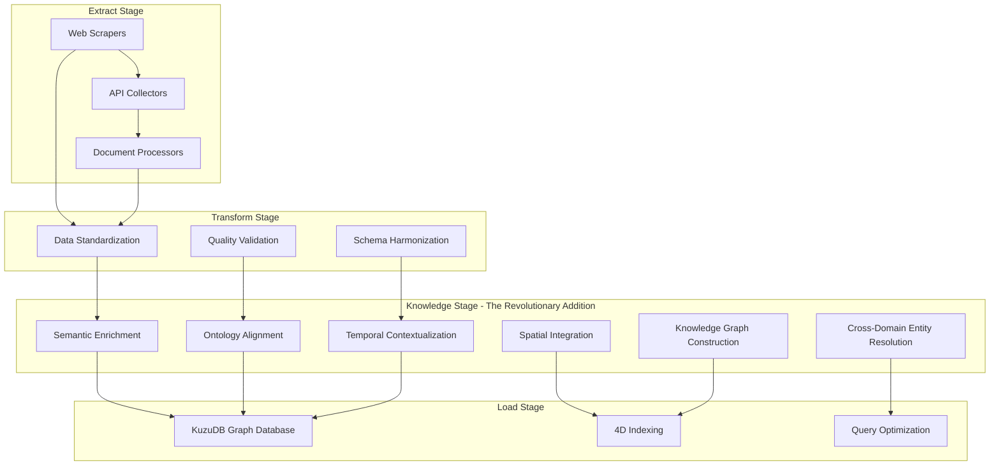

# ADR-006: ET(K)L - Revolutionary Semantic-First Data Pipeline Paradigm

**Status:** Accepted  
**Date:** 2025-09-05  
**Authors:** Agentic Data Scraper Team  
**Reviewers:** Architecture Review Board  
**Implementation Branch:** `adr-006-etkl-paradigm`

## Context

Traditional ETL (Extract, Transform, Load) pipelines suffer from a fundamental architectural limitation: semantic integration happens downstream, if at all. This creates several critical problems:

- **Late Semantic Binding**: Business context and relationships are applied after data extraction, leading to semantic gaps
- **Rigid Analytics Requirements**: Data structures must be predefined during pipeline design, limiting analytical flexibility
- **Context Loss**: Spatial, temporal, and business domain relationships are fragmented across different systems
- **Analytical Silos**: Each analytical perspective requires separate data preparation and context assembly

Through years of collaborative exploration and brainstorming, we have identified a revolutionary architectural pattern that fundamentally transforms data pipeline design. This breakthrough emerged from analyzing functional requirements across supply chain, finance, and commodities domains, revealing the need for complete semantic integration at the "first mile" of data acquisition.

### Current State Limitations

**Traditional ETL Pattern:**
```
Extract → Transform → Load
          ↓
    (Semantic integration happens downstream, creating context gaps)
```

**Problems:**
- Semantic relationships reconstructed from fragmented data
- Analytics teams must reverse-engineer business context
- Temporal and spatial context often lost or approximated
- Knowledge graphs built as separate, disconnected systems
- Each new analytical question requires pipeline redesign

### The Revolutionary Insight

The breakthrough realization: **What if we move complete semantic integration to the first mile of data acquisition?** This creates a paradigm shift from ETL to **ET(K)L - Extract Transform Knowledge Load**.

## Decision

We are adopting the **ET(K)L (Extract Transform Knowledge Load) paradigm** as our core architectural pattern, representing a fundamental shift in data pipeline design philosophy.

### ET(K)L Architecture Definition

**ET(K)L Pattern:**
```
Extract → Transform → Knowledge → Load
                      ↑
            (Complete semantic integration at first mile)
```

**Core Transformation:**
- **Traditional ETL**: Extract → Transform → Load (semantic integration downstream)
- **Revolutionary ET(K)L**: Extract → Transform → **Knowledge** → Load (complete semantic integration at acquisition)

### 4D Semantic Canvas Architecture

The ET(K)L paradigm implements a **4D Semantic Canvas** providing complete context across four dimensions regardless of analytical entry point:

#### 1. Temporal Dimension
- **Bi-Temporal Data Model**: Separate data revision time and business validity time
- **Time Series Integration**: Native temporal relationships with semantic context
- **Historical Context Preservation**: Complete audit trail with business meaning

#### 2. Spatial Dimension
- **Multi-Geometry Support**: Points, polylines, polygons with semantic relationships
- **GeoNames/OSM Integration**: Rich geographic context at ingestion
- **Spatial-Temporal Correlation**: Location-time relationships preserved semantically

#### 3. Business Domain Dimension
- **Supply Chain Ontologies**: Complete product, supplier, logistics relationships
- **Financial Domain Models**: Trading, commodities, risk management semantics
- **Cross-Domain Entity Resolution**: Unified entity graphs spanning domains

#### 4. Knowledge Graph Dimension
- **Strongly-Typed Edges**: Semantic relationships with formal ontology backing
- **Multi-Dimensional Indexing**: Optimized access patterns across all four dimensions
- **Inference Capabilities**: Automated relationship discovery and validation

### Universal Analytics Capability

The revolutionary benefit: **Analysts can start from ANY perspective and instantly access complete 4D context:**

- **Temporal-first Analysis** → Automatically discover spatial, business, and graph context
- **Spatial-first Analysis** → Automatically discover temporal, business, and graph context  
- **Business-first Analysis** → Automatically discover temporal, spatial, and graph context
- **Graph-first Analysis** → Automatically discover temporal, spatial, and business context

### Technical Implementation Architecture



### Core Technology Stack

- **KuzuDB Graph Database**: 4D indexing with temporal and spatial optimization
- **JSON-LD Semantic Integration**: W3C standard semantic markup at ingestion
- **GeoNames/OSM Spatial Semantic Integration**: Rich geographic context
- **Bi-Temporal Data Versioning**: Complete audit trail with business validity
- **Cross-Dimensional Query Optimization**: Efficient access across all four dimensions

## Consequences

### Positive

#### Revolutionary Benefits

- **Future-Proof Architecture**: No upfront analytics requirements during pipeline design
- **Complete Analytical Flexibility**: Unforeseen analytical needs automatically supported
- **Semantic Richness**: AI-driven insights enabled by complete context
- **Industry 4.0 Ready**: Perfect human-machine collaboration foundation
- **Universal Context Access**: Any analytical entry point provides complete 4D context

#### Technical Advantages

- **Reduced Time-to-Insight**: Analysts spend time on analysis, not context reconstruction
- **Elimination of Data Silos**: Single semantic fabric spans all domains
- **Automated Relationship Discovery**: Knowledge graph inference reduces manual mapping
- **Query Performance**: 4D indexing optimizes cross-dimensional queries
- **Data Quality**: Semantic validation at ingestion prevents downstream errors

#### Business Impact

- **Accelerated Decision Making**: Complete context available instantly
- **Reduced Development Costs**: No custom pipeline for each analytical need
- **Enhanced Data Governance**: Semantic relationships encode compliance rules
- **Competitive Advantage**: Unprecedented analytical agility

### Negative

#### Implementation Complexity

- **Learning Curve**: Teams must understand semantic web technologies and graph databases
- **Initial Development Overhead**: Ontology design and semantic mapping require expertise
- **Processing Performance**: Semantic enrichment adds computational overhead at ingestion
- **Storage Requirements**: Knowledge graphs require additional storage for relationships

#### Operational Challenges

- **Debugging Complexity**: Semantic relationships can create complex dependency chains
- **Schema Evolution**: Ontology changes require careful migration planning
- **Query Optimization**: Cross-dimensional queries need specialized tuning
- **Monitoring Requirements**: Semantic quality metrics need new monitoring approaches

### Neutral

#### Architectural Changes

- **Shift from SQL to Graph Queries**: Teams adapt to Cypher-style query languages
- **Different Performance Profiles**: Optimized for relationship traversal vs. aggregation
- **New Skills Requirements**: Semantic web and knowledge graph expertise needed
- **Tool Ecosystem Changes**: Graph databases, semantic validators, ontology editors

## Implementation

### Acceptance Criteria

- [ ] KuzuDB graph database deployed with 4D indexing
- [ ] JSON-LD semantic integration implemented at ingestion
- [ ] GeoNames/OSM spatial semantic integration functional
- [ ] Bi-temporal data model with revision and validity tracking
- [ ] Cross-dimensional query optimization demonstrated
- [ ] Universal analytics capability validated across all four dimensions
- [ ] Supply chain, finance, and commodities ontologies integrated
- [ ] Performance benchmarks meeting latency and throughput requirements
- [ ] Documentation and training materials for development teams
- [ ] Migration strategy for existing ETL pipelines

### Implementation Steps

#### Phase 1: Core Infrastructure (Weeks 1-4)
1. Deploy KuzuDB graph database with 4D schema design
2. Implement JSON-LD semantic enrichment pipeline
3. Integrate GeoNames and OpenStreetMap spatial semantic layers
4. Establish bi-temporal data model with audit capabilities
5. Create cross-dimensional indexing strategy

#### Phase 2: Domain Integration (Weeks 5-8)
1. Implement supply chain domain ontology (products, suppliers, logistics)
2. Integrate financial domain semantics (trading, commodities, risk)
3. Establish cross-domain entity resolution capabilities
4. Build semantic validation and quality assessment tools
5. Optimize query performance across dimensions

#### Phase 3: Analytics Interface (Weeks 9-12)
1. Develop universal analytics query interface
2. Implement context discovery algorithms for each dimensional entry point
3. Create visualization tools for 4D semantic relationships
4. Build performance monitoring and alerting
5. Establish semantic data governance framework

#### Phase 4: Production Deployment (Weeks 13-16)
1. Migrate pilot data pipelines to ET(K)L pattern
2. Train development and analytics teams
3. Establish operational procedures and monitoring
4. Document best practices and architectural patterns
5. Plan rollout strategy for remaining pipelines

### Migration Strategy

#### Existing Pipeline Evolution
1. **Assessment Phase**: Analyze existing ETL pipelines for semantic enrichment opportunities
2. **Parallel Implementation**: Run ET(K)L alongside existing pipelines for validation
3. **Gradual Migration**: Move pipelines to ET(K)L pattern based on business priority
4. **Legacy Integration**: Maintain backwards compatibility during transition period
5. **Sunset Planning**: Decommission traditional ETL once migration complete

#### Data Migration Approach
- **Incremental Semantic Enrichment**: Add semantic layers to existing data progressively
- **Backwards Compatibility**: Maintain existing API contracts during transition
- **Quality Validation**: Ensure semantic enrichment doesn't compromise data quality
- **Performance Monitoring**: Track performance impact and optimize continuously

## Monitoring and Success Metrics

### Revolutionary Impact Metrics

#### Analytical Agility
- **Time-to-Insight Reduction**: Measure reduction in time from question to answer
- **Context Discovery Speed**: Time to access complete 4D context from any entry point
- **Unforeseen Question Support**: Percentage of ad-hoc analytical questions supported without pipeline modification

#### Technical Performance
- **Cross-Dimensional Query Latency**: Sub-second response times across all four dimensions
- **Semantic Enrichment Throughput**: Data processing rate with full semantic integration
- **Storage Efficiency**: Relationship storage overhead vs. traditional normalized schemas
- **Query Optimization Success**: Performance improvement from 4D indexing

#### Business Value
- **Decision Making Speed**: Reduction in time for strategic business decisions
- **Data Silo Elimination**: Percentage of cross-domain queries supported natively
- **Development Cost Reduction**: Decrease in custom pipeline development costs
- **Competitive Analytics Advantage**: Time-to-market improvement for new analytical capabilities

### Warning Signs

- **Semantic Quality Degradation**: Decrease in relationship accuracy or completeness
- **Performance Bottlenecks**: Query latency exceeding acceptable thresholds
- **Complexity Overhead**: Development productivity declining due to semantic complexity
- **Operational Challenges**: Increased operational burden beyond business value

### Success Thresholds

- **Query Performance**: 95% of queries complete within 2 seconds
- **Context Completeness**: 99% of analytical entry points provide complete 4D context
- **Semantic Quality**: 98% accuracy in automated relationship discovery
- **Developer Productivity**: No decrease in pipeline development velocity
- **Business Impact**: 50% reduction in time-to-insight for strategic questions

## References

### Related ADRs
- **[ADR-005](./ADR-005-spatio-temporal-sow-architecture.md)**: KuzuDB Graph Database foundation
- **[ADR-004](./ADR-004-semantic-sow-data-contracts.md)**: Semantic SOW architecture
- **[ADR-003](./ADR-003-baml-agent-architecture.md)**: Multi-agent architecture enabling semantic integration

### Technical References
- **[KuzuDB Documentation](https://kuzudb.com/docs/)**: Graph database with temporal support
- **[JSON-LD Specification](https://www.w3.org/TR/json-ld11/)**: W3C semantic web standard
- **[GeoNames Ontology](http://www.geonames.org/ontology/)**: Geographic semantic integration
- **[OpenStreetMap Semantics](https://wiki.openstreetmap.org/wiki/Semantic_Web)**: Spatial relationship modeling
- **[Bi-Temporal Data Models](https://en.wikipedia.org/wiki/Temporal_database)**: Time dimension modeling

### Research and Inspiration
- **Semantic Web Best Practices**: W3C recommendations for knowledge representation
- **Graph Database Patterns**: Industry patterns for multi-dimensional graph modeling
- **Industry 4.0 Architecture**: Human-machine collaboration frameworks
- **Knowledge Graph Construction**: Automated relationship discovery techniques

### Implementation Examples
- **Supply Chain Semantic Integration**: Product-supplier-logistics ontology examples
- **Financial Domain Modeling**: Trading-commodities-risk semantic patterns
- **Cross-Domain Entity Resolution**: Multi-industry entity linking strategies
- **4D Query Optimization**: Performance patterns for cross-dimensional access

## Revision History

| Date | Author | Changes |
|------|--------|---------|
| 2025-09-05 | Agentic Data Scraper Team | Initial version documenting ET(K)L paradigm breakthrough |

---

**Paradigm Shift Summary:**

This ADR documents a **revolutionary breakthrough in data pipeline architecture**. The ET(K)L paradigm represents a fundamental shift from traditional ETL approaches, moving complete semantic integration to the "first mile" of data acquisition. This enables unprecedented analytical flexibility through universal 4D context access, positioning our architecture at the forefront of Industry 4.0 human-machine collaboration.

**The revolution: Instead of reconstructing context downstream, we capture complete semantic relationships at ingestion, creating a future-proof foundation that adapts to any analytical need.**