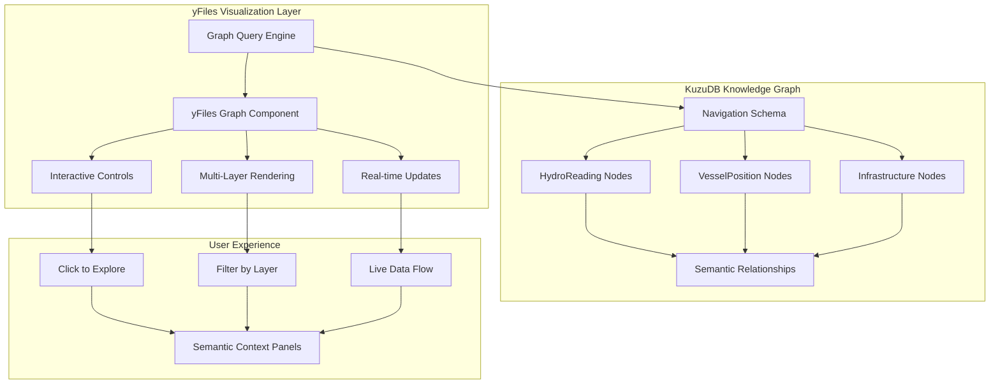

# ADR-010: Interactive Graph Visualization with yFiles for KuzuDB

## Status
**PROPOSED** - Critical enhancement for user experience and semantic graph exploration

## Context

Our semantic ET(K)L system successfully creates rich knowledge graphs in KuzuDB, but current visualization capabilities are limited:

```
❌ Current Limitations:
- Basic NetworkX/GraphViz static visualizations
- No interactive exploration of semantic relationships
- Limited ability to show multi-layered graph structures
- Poor user experience for understanding graph connections
- No real-time graph updates or animations

🎯 Vision: Professional Interactive Graph Experience
- Interactive exploration of semantic knowledge graph
- Real-time visualization of data flowing through relationships
- Multi-layer graphs (vessels, infrastructure, waterways, commodities)
- Professional-quality visualizations for demonstrations
- Direct integration with KuzuDB queries
```

**Key Insight**: Users need to **interact with and explore** the knowledge graph to truly understand the revolutionary power of semantic ET(K)L architecture.

## Decision

We will implement **yFiles-powered interactive graph visualization** integrated directly with our KuzuDB knowledge graph:

1. **yFiles Integration** - Professional graph visualization library
2. **KuzuDB Direct Connection** - Real-time graph queries and updates
3. **Multi-Layer Visualization** - Different entity types with distinct styling
4. **Interactive Exploration** - Click, hover, expand, filter capabilities
5. **Jupyter Integration** - Embedded interactive graphs in notebook demonstrations

## Architecture Overview



## Implementation Components

### 1. KuzuDB Graph Query Engine
```python
class KuzuGraphQueryEngine:
    """Optimized queries for graph visualization"""
    
    def __init__(self, kuzu_connection):
        self.conn = kuzu_connection
        
    async def get_graph_neighborhood(self, node_id: str, radius: int = 2) -> Dict:
        """Get neighborhood graph around a specific node"""
        query = f"""
        MATCH (center {{id: '{node_id}'}})-[r*1..{radius}]-(neighbor)
        RETURN center, r, neighbor
        """
        
        result = self.conn.execute(query)
        return self._format_for_yfiles(result)
        
    async def get_semantic_layer(self, layer_type: str) -> Dict:
        """Get specific semantic layer (vessels, infrastructure, etc.)"""
        query = f"""
        MATCH (n:{layer_type})-[r]-(m)
        RETURN n, r, m
        """
        
        result = self.conn.execute(query)
        return self._format_for_yfiles(result)
        
    def _format_for_yfiles(self, kuzu_result) -> Dict:
        """Convert KuzuDB result to yFiles graph format"""
        nodes = []
        edges = []
        
        for record in kuzu_result:
            # Extract nodes and relationships
            # Format for yFiles consumption
            pass
            
        return {"nodes": nodes, "edges": edges}
```

### 2. yFiles Interactive Component
```javascript
// yFiles graph component for Jupyter integration
class SemanticGraphVisualization {
    constructor(containerId, graphData) {
        this.container = document.getElementById(containerId);
        this.graphComponent = new yfiles.view.GraphComponent(this.container);
        this.setupInteractivity();
        this.loadGraphData(graphData);
    }
    
    setupInteractivity() {
        // Enable interactive exploration
        this.graphComponent.inputMode = new yfiles.input.GraphViewerInputMode({
            clickableItems: yfiles.graph.GraphItemTypes.NODE | yfiles.graph.GraphItemTypes.EDGE,
            selectableItems: yfiles.graph.GraphItemTypes.NODE | yfiles.graph.GraphItemTypes.EDGE,
            marqueeSelectableItems: yfiles.graph.GraphItemTypes.NODE
        });
        
        // Add click handlers for semantic exploration
        this.graphComponent.addItemClickedListener((sender, args) => {
            this.onNodeClicked(args.item);
        });
        
        // Add hover for context information
        this.graphComponent.addItemHoveredListener((sender, args) => {
            this.showSemanticContext(args.item);
        });
    }
    
    loadGraphData(graphData) {
        // Load nodes with semantic styling
        graphData.nodes.forEach(node => {
            this.addSemanticNode(node);
        });
        
        // Load relationships with semantic styling
        graphData.edges.forEach(edge => {
            this.addSemanticRelationship(edge);
        });
        
        // Apply automatic layout
        this.applySemanticLayout();
    }
    
    addSemanticNode(nodeData) {
        const node = this.graphComponent.graph.createNode();
        
        // Style based on semantic type
        const style = this.getSemanticNodeStyle(nodeData.type);
        this.graphComponent.graph.setStyle(node, style);
        
        // Add semantic metadata
        node.tag = nodeData.semantics;
    }
    
    getSemanticNodeStyle(nodeType) {
        const styles = {
            'gauge_station': new yfiles.styles.ShapeNodeStyle({
                fill: '#4a90e2',
                shape: 'circle'
            }),
            'vessel': new yfiles.styles.ShapeNodeStyle({
                fill: '#e24a4a',
                shape: 'triangle'
            }),
            'infrastructure': new yfiles.styles.ShapeNodeStyle({
                fill: '#4ae24a',
                shape: 'rectangle'
            })
        };
        
        return styles[nodeType] || styles['default'];
    }
    
    onNodeClicked(node) {
        // Expand neighborhood or show details
        this.expandSemanticNeighborhood(node);
        this.showSemanticDetailPanel(node);
    }
    
    expandSemanticNeighborhood(node) {
        // Query KuzuDB for more connected nodes
        const nodeId = node.tag.id;
        fetch(`/api/graph/neighborhood/${nodeId}`)
            .then(response => response.json())
            .then(data => this.addGraphData(data));
    }
}
```

### 3. Jupyter Notebook Integration
```python
class InteractiveSemanticGraph:
    """Jupyter-integrated graph visualization"""
    
    def __init__(self, kuzu_connection):
        self.query_engine = KuzuGraphQueryEngine(kuzu_connection)
        
    def display_semantic_graph(self, query: str = None, layers: List[str] = None):
        """Display interactive graph in Jupyter cell"""
        
        # Get graph data from KuzuDB
        if query:
            graph_data = self.query_engine.execute_custom_query(query)
        elif layers:
            graph_data = self.query_engine.get_multiple_layers(layers)
        else:
            graph_data = self.query_engine.get_full_graph()
        
        # Generate unique container ID
        container_id = f"semantic_graph_{uuid.uuid4().hex[:8]}"
        
        # Display HTML/JavaScript component
        display(HTML(f'''
        <div id="{container_id}" style="width: 100%; height: 600px; border: 1px solid #ccc;">
            Loading interactive semantic graph...
        </div>
        <script>
            // Load yFiles if not already loaded
            if (typeof yfiles === 'undefined') {{
                const script = document.createElement('script');
                script.src = 'https://unpkg.com/yfiles@latest/yfiles.js';
                script.onload = () => initializeGraph();
                document.head.appendChild(script);
            }} else {{
                initializeGraph();
            }}
            
            function initializeGraph() {{
                const graphData = {json.dumps(graph_data)};
                new SemanticGraphVisualization('{container_id}', graphData);
            }}
        </script>
        '''))
        
    def create_mississippi_river_graph(self):
        """Create specific visualization for Mississippi River navigation"""
        
        query = """
        MATCH (station:HydroReading)-[:LOCATED_ON]->(segment:WaterwaySegment)
        MATCH (vessel:VesselPosition)-[:NAVIGATES]->(segment)
        MATCH (infrastructure)-[:CONTROLS_FLOW]->(segment)
        RETURN station, segment, vessel, infrastructure
        LIMIT 100
        """
        
        self.display_semantic_graph(query=query)
        
    def create_live_updating_graph(self, update_interval: int = 30):
        """Create graph that updates in real-time"""
        
        # Initial display
        self.display_semantic_graph()
        
        # JavaScript for live updates
        display(Javascript(f'''
        setInterval(() => {{
            fetch('/api/graph/updates')
                .then(response => response.json())
                .then(updates => {{
                    // Update graph with new data
                    if (window.semanticGraph) {{
                        window.semanticGraph.updateWithLiveData(updates);
                    }}
                }});
        }}, {update_interval * 1000});
        '''))
```

## Enhanced Jupyter Notebook Experience

### Demo Cell: Interactive Graph Exploration
```python
# New notebook cell for interactive graph demonstration
def demonstrate_interactive_semantic_graph():
    """Show the power of interactive semantic graph exploration"""
    
    print("🕸️ Interactive Semantic Knowledge Graph")
    print("=" * 45)
    print("🎯 Click nodes to explore relationships")
    print("🔍 Hover for semantic context")
    print("🎛️ Use controls to filter layers")
    
    # Create interactive graph component
    graph_viz = InteractiveSemanticGraph(orchestrator.navigation_queries.conn)
    
    print("\n📊 Mississippi River Navigation Network:")
    graph_viz.create_mississippi_river_graph()
    
    print("\n🔄 Live Data Flow (updates every 30 seconds):")
    graph_viz.create_live_updating_graph(update_interval=30)
    
    print("\n💡 Interactive Features:")
    print("   • Click gauge stations to see connected vessels")
    print("   • Click vessels to see navigation history")
    print("   • Click infrastructure to see impact radius")
    print("   • Filter by entity type using layer controls")
    print("   • Watch real-time updates as new data arrives")

# Add to notebook
demonstrate_interactive_semantic_graph()
```

## Multi-Layer Visualization Concept

### Layer Types and Styling
```javascript
const SEMANTIC_LAYERS = {
    'hydrology': {
        nodes: ['HydroReading', 'WaterwaySegment'],
        color: '#4a90e2',
        icon: '🌊'
    },
    'transportation': {
        nodes: ['VesselPosition', 'Vessel'],
        color: '#e24a4a',
        icon: '🚢'
    },
    'infrastructure': {
        nodes: ['Lock', 'Port', 'Bridge'],
        color: '#4ae24a',
        icon: '🏗️'
    },
    'economics': {
        nodes: ['MarketPrice', 'Commodity'],
        color: '#e2e24a',
        icon: '💰'
    }
};
```

## Benefits

### 1. Revolutionary User Experience
- **Interactive exploration** reveals semantic relationships intuitively
- **Professional visualizations** demonstrate system sophistication
- **Real-time updates** show live semantic data flow
- **Multi-layer filtering** enables focused analysis

### 2. Enhanced Demonstration Power
- **Jupyter notebook becomes interactive playground**
- **Click-to-explore** semantic relationships
- **Visual proof** of knowledge graph power
- **Immediate understanding** of semantic ET(K)L benefits

### 3. Advanced Analytics Capabilities
- **Graph algorithms** for path finding and centrality
- **Visual pattern recognition** in semantic relationships
- **Interactive debugging** of semantic enrichment
- **Real-time monitoring** of knowledge graph evolution

## Implementation Timeline

### Phase 1: Foundation (Week 1-2)
- [ ] Set up yFiles development environment
- [ ] Create KuzuDB to yFiles data conversion
- [ ] Basic interactive graph component
- [ ] Jupyter notebook integration

### Phase 2: Semantic Features (Week 3-4)
- [ ] Multi-layer visualization with semantic styling
- [ ] Interactive exploration (click, hover, expand)
- [ ] Semantic context panels
- [ ] Real-time update capabilities

### Phase 3: Advanced Features (Week 5-6)
- [ ] Graph algorithms integration
- [ ] Advanced filtering and search
- [ ] Export and sharing capabilities
- [ ] Performance optimization for large graphs

## Success Criteria

1. **Interactive graph displays** in Jupyter notebook with semantic styling
2. **Click exploration** reveals connected semantic relationships
3. **Real-time updates** show live data flowing through graph
4. **Multi-layer filtering** enables focused semantic analysis
5. **Professional visualization quality** suitable for executive demonstrations
6. **Performance handles** 1000+ nodes with smooth interaction

## Related ADRs

- ADR-007: Resolvable Semantic URIs (provides URIs for graph node linking)
- ADR-008: Rich Spatial Context (provides spatial layout for graph positioning)
- ADR-009: Temporal-Spatial Canvas (complements with graph-based analytics)