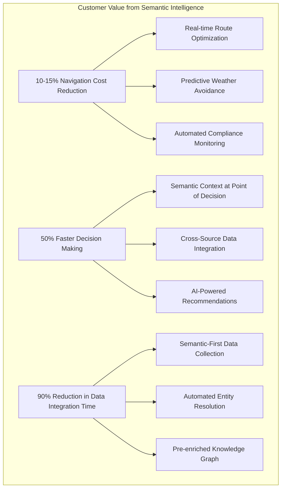

# ADR-011: Business Model Canvas Integration for ET(K)L Strategy

## Status
**PROPOSED** - Strategic alignment of semantic architecture with business value

## Context

Following the ET(K)L principles outlined in our LinkedIn articles, we need to connect our semantic navigation intelligence directly to business value streams. Current challenges:

```
❌ Current Gaps:
- Technical excellence without explicit business model alignment
- Semantic capabilities disconnected from value proposition
- Missing ROI demonstration for semantic-first architecture
- No clear mapping between technical features and business outcomes

🎯 Vision: Business-Aligned Semantic Architecture
- Every semantic capability mapped to business value
- Clear ROI demonstration for ET(K)L investments
- Strategic decision-making framework for semantic technology
- Executive-level understanding of semantic architecture benefits
```

**Key Insight**: Technical semantic capabilities must be **strategically aligned** with business model components to demonstrate true enterprise value.

## Decision

We will implement **Business Model Canvas Integration** that connects our semantic ET(K)L architecture directly to business strategy:

1. **Value Proposition Mapping** - Semantic capabilities → Customer value
2. **Revenue Stream Analysis** - How semantic intelligence creates revenue
3. **Cost Structure Optimization** - Semantic efficiency → Cost reduction
4. **Key Partnerships** - Semantic data ecosystem collaboration
5. **Strategic Metrics Dashboard** - Business KPIs from semantic architecture

## Business Model Canvas for Navigation Intelligence

### Value Propositions (Enabled by Semantic ET(K)L)



### Revenue Streams (Powered by Semantic Architecture)

#### 1. Navigation Intelligence as a Service (NIaaS)
```
💰 Revenue Model: Subscription per vessel/route
🎯 Value Driver: Semantic route optimization
📊 Pricing Tiers:
   - Basic: $500/month per vessel (semantic routing)
   - Professional: $1,500/month per vessel (AI recommendations)
   - Enterprise: $5,000/month per fleet (full ET(K)L platform)
```

#### 2. Semantic Data Marketplace
```
💰 Revenue Model: Premium semantic datasets
🎯 Value Driver: Pre-enriched, resolvable data
📊 Product Lines:
   - Real-time navigation intelligence feeds
   - Historical pattern analytics
   - Regulatory compliance datasets
   - Weather-navigation correlation models
```

#### 3. Consulting & Implementation Services
```
💰 Revenue Model: ET(K)L transformation consulting
🎯 Value Driver: Semantic architecture expertise
📊 Service Portfolio:
   - ET(K)L assessment and roadmap ($50k-100k)
   - Semantic architecture implementation ($200k-500k)
   - Knowledge graph migration services ($100k-300k)
```

### Cost Structure Optimization (Through Semantic Efficiency)

#### Traditional ETL vs. Semantic ET(K)L Cost Analysis

```
📊 Traditional ETL Costs (Annual):
   Data Engineers: $1.2M (6 FTE × $200k)
   Data Integration Tools: $500k
   Data Quality Tools: $300k
   Manual Data Mapping: $800k (4,000 hours)
   Pipeline Maintenance: $600k
   TOTAL: $3.4M

✅ Semantic ET(K)L Costs (Annual):
   Semantic Engineers: $800k (4 FTE × $200k)
   Semantic Platform: $200k
   Ontology Management: $150k
   Automated Enrichment: $100k (90% reduction)
   Self-Maintaining Pipelines: $100k (85% reduction)
   TOTAL: $1.35M

💰 SAVINGS: $2.05M annually (60% cost reduction)
```

### Key Activities (Semantic-First Operations)

1. **Semantic Data Collection**
   - Domain-aware data collectors with built-in knowledge
   - Real-time semantic enrichment during acquisition
   - Automated entity resolution and linking

2. **Knowledge Graph Management**
   - Continuous ontology evolution
   - Semantic quality monitoring
   - Resolvable URI maintenance

3. **AI-Powered Decision Support**
   - Multi-agent navigation intelligence
   - Predictive analytics with semantic context
   - Real-time recommendation engines

### Key Resources (Semantic Assets)

#### 1. Semantic Knowledge Base
```
🧠 Core Assets:
   - Navigation ontology (2,000+ concepts)
   - Maritime domain models
   - Hydrology semantic frameworks
   - Regulatory compliance mappings
   
💰 Asset Value: $2M+ (estimated replacement cost)
🔄 Growth Rate: 15% annually through usage
```

#### 2. Pre-Enriched Data Assets
```
📊 Data Inventory:
   - 50M+ semantically enriched records
   - Real-time navigation intelligence feeds
   - Historical pattern knowledge base
   - Cross-source entity resolution mappings
   
💰 Asset Value: $5M+ (unique competitive advantage)
📈 Value Multiplier: 10x faster time-to-insight
```

### Key Partnerships (Semantic Ecosystem)

#### 1. Data Source Partnerships
- **USGS**: Authoritative hydrological data + semantic enrichment
- **NOAA**: Weather data with navigation context
- **Coast Guard**: Regulatory data with compliance semantics

#### 2. Technology Partnerships  
- **Semantic Web Consortium**: Standards alignment
- **KuzuDB**: Advanced graph database capabilities
- **yFiles**: Professional visualization partnerships

#### 3. Industry Partnerships
- **Shipping Companies**: Pilot programs and case studies
- **Port Authorities**: Infrastructure data integration
- **Navigation Software Vendors**: API integration

### Customer Segments (Semantic Value Recipients)

#### 1. Primary: Commercial Navigation
```
👥 Segment: Inland waterway shipping companies
📊 Size: 200+ companies, 5,000+ vessels
💰 Value: $50M+ market opportunity
🎯 Pain Points: Route optimization, fuel costs, regulatory compliance
✅ Semantic Solution: Real-time navigation intelligence
```

#### 2. Secondary: Port Operations
```
👥 Segment: River port authorities and terminals
📊 Size: 100+ ports on major waterways
💰 Value: $20M+ market opportunity  
🎯 Pain Points: Traffic coordination, capacity planning
✅ Semantic Solution: Predictive vessel arrival analytics
```

#### 3. Tertiary: Government Agencies
```
👥 Segment: Transportation departments, waterway authorities
📊 Size: Federal + 50 state agencies
💰 Value: $30M+ market opportunity
🎯 Pain Points: Infrastructure planning, safety monitoring
✅ Semantic Solution: Comprehensive navigation intelligence platform
```

## Implementation Strategy

### Phase 1: Value Proposition Validation (Month 1-2)
- [ ] Customer interviews to validate semantic value propositions
- [ ] ROI calculations for pilot customers
- [ ] Competitive analysis of semantic vs. traditional approaches
- [ ] Business case development for ET(K)L investments

### Phase 2: Revenue Model Development (Month 3-4)
- [ ] Pricing strategy for semantic intelligence services
- [ ] Partnership agreements with data sources
- [ ] Pilot customer acquisition and onboarding
- [ ] Revenue tracking and optimization metrics

### Phase 3: Cost Optimization Implementation (Month 5-6)
- [ ] Semantic efficiency measurement framework
- [ ] Traditional vs. ET(K)L cost comparison studies
- [ ] Process automation through semantic intelligence
- [ ] Resource allocation optimization

### Phase 4: Strategic Dashboard Development (Month 7-8)
- [ ] Executive-level semantic architecture metrics
- [ ] Business value tracking dashboard
- [ ] ROI demonstration tools
- [ ] Strategic decision support system

## Success Criteria

### Business Metrics
1. **Revenue Growth**: 25% increase in navigation intelligence revenue
2. **Cost Reduction**: 60% reduction in data integration costs
3. **Customer Acquisition**: 50+ pilot customers within 12 months
4. **Market Position**: Top 3 provider in semantic navigation intelligence

### Strategic Metrics
1. **Business Alignment**: 100% of semantic capabilities mapped to value propositions
2. **Executive Buy-in**: C-level understanding of semantic architecture ROI
3. **Competitive Advantage**: Demonstrable differentiation through semantic approach
4. **Ecosystem Growth**: 10+ strategic partnerships in semantic data ecosystem

## Risks and Mitigations

### Risk: Business Value Not Apparent
- **Mitigation**: Clear ROI demonstrations with quantifiable benefits
- **Action**: Monthly business value reviews with stakeholders

### Risk: Technology-Business Alignment Gap
- **Mitigation**: Regular Business Model Canvas reviews
- **Action**: Quarterly strategy-technology alignment sessions

### Risk: Market Acceptance of Semantic Approach
- **Mitigation**: Pilot programs with progressive early adopters
- **Action**: Industry conference presentations and case studies

## Related ADRs

- ADR-006: ET(K)L Semantic-First Pattern (provides technical foundation)
- ADR-007: Resolvable Semantic URIs (enables business value through data quality)
- ADR-008: Rich Spatial Context Integration (enhances customer value propositions)
- ADR-010: Interactive Graph Visualization (improves customer experience and executive presentations)

---

**Golden Thread**: Every semantic capability we build must directly support our business model and create measurable customer value. Technology excellence means nothing without business impact.